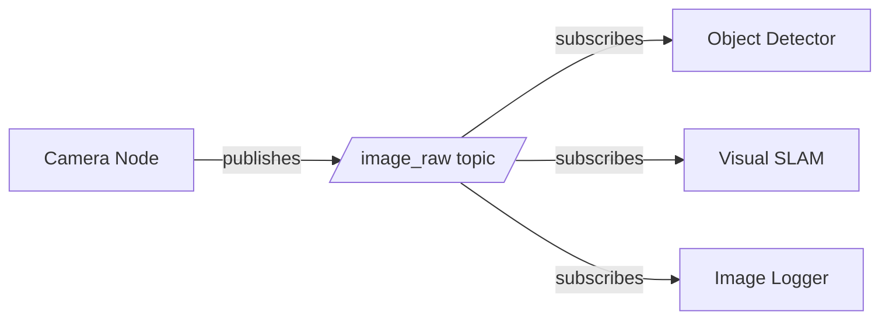
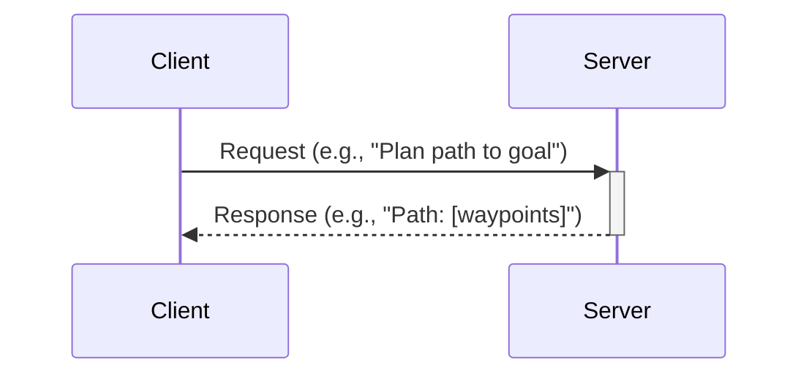
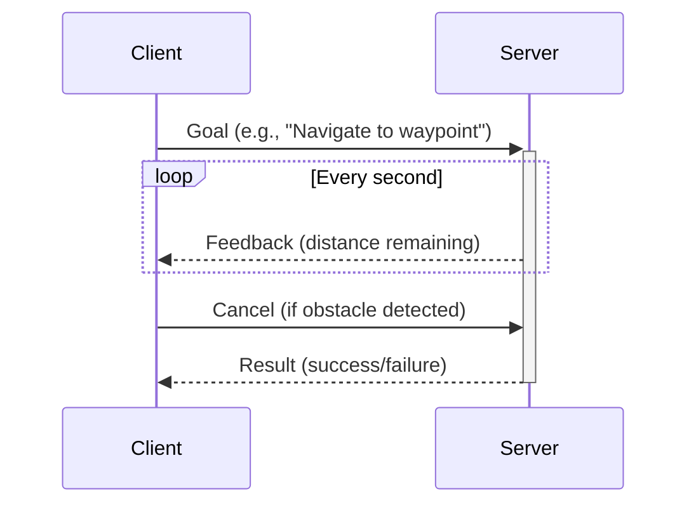

# ROS 2 Architecture: The Robotic Nervous System

ROS 2 (Robot Operating System 2) is not an operating system in the traditional sense—it's a **middleware framework** that enables distributed communication between software modules running on one or more computers. Think of it as the nervous system of a robot, coordinating sensors, actuators, and intelligence layers.

## Why ROS 2?

ROS 1 revolutionized robotics research but had limitations for production systems:
- **Single point of failure**: ROS Master crashes halted entire systems
- **No real-time support**: Timing guarantees were difficult to achieve
- **Limited multi-robot**: Poor support for robot swarms
- **Security**: No encryption or authentication

ROS 2 addresses these issues with a new architecture built on **DDS (Data Distribution Service)**, an industry-standard middleware providing:
- Decentralized discovery (no master node)
- Quality of Service (QoS) policies for reliability and real-time performance
- Security features (SROS2 for encrypted communication)
- Better Windows and embedded platform support

## Core Concepts

### Nodes: Independent Processes

A **node** is a single-purpose process that performs computation. Examples:
- A camera driver node publishes image data
- A motion planner node subscribes to sensor data and publishes velocity commands
- A motor controller node subscribes to commands and drives actuators

Nodes are designed to be **modular and reusable**. A humanoid robot might have dozens of nodes running simultaneously:

```
Humanoid Robot System
├── camera_node (publishes images)
├── lidar_node (publishes point clouds)
├── perception_node (detects objects)
├── planning_node (generates paths)
├── control_node (sends joint commands)
└── state_estimator_node (tracks robot pose)
```

### Topics: Asynchronous Publish-Subscribe

**Topics** enable **many-to-many** asynchronous communication. A node publishes messages to a topic, and any number of nodes can subscribe.



**Key Characteristics:**
- Publishers and subscribers are **decoupled**: they don't need to know about each other
- **Fire-and-forget**: Publishers send data without waiting for acknowledgment
- **Scalable**: Adding new subscribers doesn't change publishers

**Example**: A camera publishes to `/camera/image_raw` at 30 Hz. Multiple nodes (object detection, SLAM, logging) subscribe independently.

### Services: Synchronous Request-Response

**Services** provide **one-to-one** synchronous communication. A client node sends a request and waits for a response.



**Use Cases:**
- Trigger actions (e.g., "Start/stop motor")
- Query state (e.g., "Get current battery level")
- Perform computations (e.g., "Inverse kinematics for target pose")

**Example**: A motion planner calls a `/compute_ik` service to get joint angles for a desired end-effector position.

### Actions: Long-Running Tasks with Feedback

**Actions** extend services with **feedback** and **cancellation** for long-running goals.



**Use Cases:**
- Navigation: Drive to a goal while reporting progress
- Manipulation: Execute a grasp sequence with status updates
- Speech synthesis: Speak a sentence with word-by-word feedback

**Example**: A humanoid robot receives a "walk to kitchen" action. It sends periodic feedback (current position, distance to goal) and can be canceled if a human blocks the path.

## Messages, Services, and Action Definitions

### Messages

Messages define the data structure for topics. Example (`sensor_msgs/Image`):

```
Header header
uint32 height
uint32 width
string encoding
uint8[] data
```

**Built-in Message Packages:**
- `std_msgs`: Basic types (Int32, String, Float64)
- `sensor_msgs`: Sensor data (Image, LaserScan, Imu, PointCloud2)
- `geometry_msgs`: Spatial data (Pose, Twist, Transform)

### Service Definitions

Services have a request and response part. Example (`AddTwoInts`):

```
int64 a
int64 b
---
int64 sum
```

### Action Definitions

Actions have goal, feedback, and result. Example (`NavigateToPose`):

```
geometry_msgs/PoseStamped pose
---
---
geometry_msgs/PoseStamped current_pose
float32 distance_remaining
```

## Computation Graph and Discovery

ROS 2 uses a **computation graph** where nodes are vertices and communication channels (topics/services/actions) are edges. Discovery is **automatic**: when a new node starts, it announces itself via DDS, and other nodes learn about it without a central registry.

**List Running Nodes:**
```bash
ros2 node list
```

**View Node Connections:**
```bash
ros2 node info /camera_node
```

**Visualize Graph:**
```bash
rqt_graph
```

This displays the entire system's communication topology in real-time.

## Quality of Service (QoS)

QoS policies control reliability, latency, and resource usage. Key settings:

| QoS Policy | Options | Use Case |
|------------|---------|----------|
| **Reliability** | Best Effort, Reliable | Sensor streams (best effort) vs commands (reliable) |
| **Durability** | Volatile, Transient Local | Forget old data vs retain for late joiners |
| **History** | Keep Last N, Keep All | Limit memory usage vs ensure no loss |

**Example**: A camera publishes images with "Best Effort" QoS (drop frames if slow subscribers). A safety stop command uses "Reliable" QoS (guarantee delivery).

## Namespaces and Remapping

**Namespaces** group related nodes and topics:

```bash
ros2 run my_package camera_node --ros-args -r __ns:=/robot1
```

This creates `/robot1/camera_node` and publishes to `/robot1/image_raw`.

**Remapping** changes topic names without modifying code:

```bash
ros2 run my_package subscriber_node --ros-args -r input:=/camera/image_raw
```

## Launch Files: Orchestrating Systems

Launch files start multiple nodes with configuration in a single command. Example (Python launch file):

```python
from launch import LaunchDescription
from launch_ros.actions import Node

def generate_launch_description():
    return LaunchDescription([
        Node(
            package='camera_driver',
            executable='camera_node',
            name='camera',
            parameters=[{'frame_rate': 30}]
        ),
        Node(
            package='image_processor',
            executable='detector_node',
            name='detector'
        )
    ])
```

Run with:
```bash
ros2 launch my_package robot.launch.py
```

## Parameter Server

Nodes can declare **parameters** (configuration values) that can be set at runtime:

```bash
ros2 param set /camera_node frame_rate 60
ros2 param get /camera_node frame_rate
```

Parameters enable reconfiguration without recompiling code.

## Practical Example: Minimal Publisher-Subscriber

We'll implement this in the next chapter, but conceptually:

**Publisher** (Python):
- Creates a node
- Declares a publisher on topic `/chatter`
- Publishes "Hello World: N" every second

**Subscriber** (Python):
- Creates a node
- Subscribes to `/chatter`
- Prints received messages

This simple example demonstrates the core ROS 2 pattern that scales to complex robotic systems.

## Conclusion

ROS 2's architecture—nodes communicating via topics, services, and actions—provides a flexible, scalable foundation for robotic systems. Understanding these concepts is essential before writing code. In the next chapter, we'll implement Python controllers using `rclpy`, bringing these abstractions to life.

## References

- Macenski, S., et al. (2022). "Robot Operating System 2: Design, architecture, and uses in the wild." *Science Robotics*, 7(66).
- Open Robotics. (2024). "ROS 2 Concepts." Retrieved from https://docs.ros.org/en/humble/Concepts.html
- Object Management Group. (2015). "Data Distribution Service (DDS) Version 1.4." OMG Document formal/2015-04-10.
